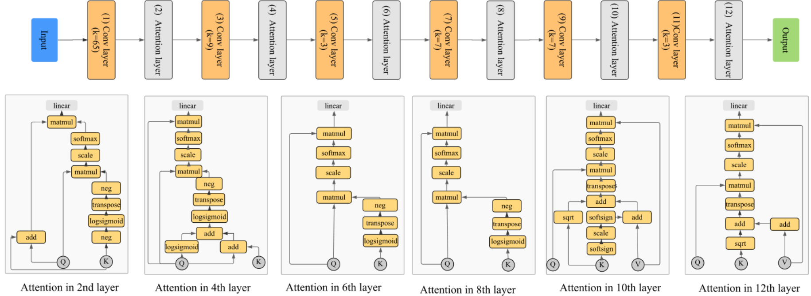

# AutoBERT-Zero-pytorch
AutoBERT-Zero论文非官方代码，个人复现。

# Paper
**[AutoBERT-Zero: Evolving BERT Backbone from Scratch](https://arxiv.org/pdf/2107.07445)**  
*Jiahui Gao, Hang Xu, Han shi, Xiaozhe Ren, Philip L.H. Yu, Xiaodan Liang, Xin Jiang, Zhenguo Li*

<p align="center">
    
</p>


# Install
```bash
pip install git+https://github.com/JunnYu/AutoBERT-Zero-pytorch
or
pip install autobert
```

# Wandb Logs
https://wandb.ai/junyu/huggingface/runs/howc6tps?workspace=user-junyu
感觉small模型训练出来效果不怎么样，不知道是哪里出错了。

# Usage
```python
import torch
from transformers import BertTokenizerFast

from autobert import AutoBertModelForMaskedLM

device = torch.device("cuda:0" if torch.cuda.is_available() else "cpu")

for model in ["junnyu/autobert-small-light","junnyu/autobert-small-sdconv"]:
    tokenizer = BertTokenizerFast.from_pretrained(model)
    model = AutoBertModelForMaskedLM.from_pretrained(model)
    model.to(device)

    text = "Beijing is the capital of [MASK]."
    inputs = tokenizer(text, return_tensors="pt")
    inputs.to(device)

    # pytorch
    with torch.no_grad():
        outputs = model(**inputs).logits[0]

    pt_outputs_sentence = ""
    for i, id in enumerate(tokenizer.encode(text)):
        if id == tokenizer.mask_token_id:
            prob, indice = outputs[i].softmax(-1).topk(k=5)
            tokens = tokenizer.convert_ids_to_tokens(indice)
            slist = []
            for p, t in zip(prob, tokens):
                slist.append(t + "+" + str(round(p.item(), 4)))
            pt_outputs_sentence += " " + "[ " + " || ".join(slist) + " ]"
        else:
            pt_outputs_sentence += " " + "".join(
                tokenizer.convert_ids_to_tokens([id], skip_special_tokens=True)
            )

    print(pt_outputs_sentence.strip())

```
